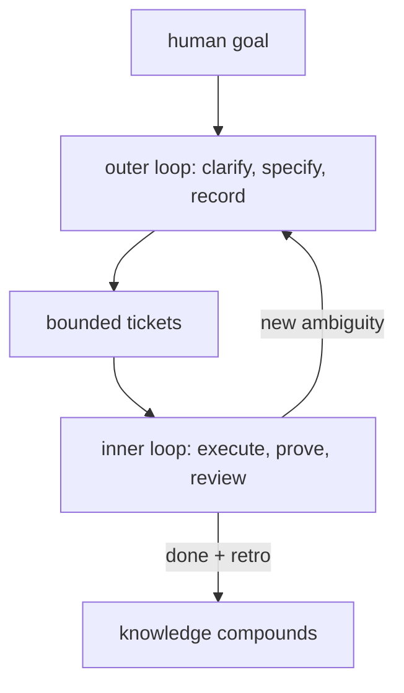

<p align="center">
  
</p>

<h1 align="center">10x</h1>

<p align="center">
  <em>The engineering discipline that makes your [AI] developer 10x — hill-climbed through billions of tokens of autonomous experimentation.</em>
</p>

<p align="center">
  
  
  
  
</p>

---

You've worked with a 10x developer. They aren't 10x because they type faster
or write more code. In fact, they usually write less. They're 10x because they
eliminate entire classes of problems instead of solving tickets one at a time.
They treat code as a liability - every line is a line that has to be tested,
debugged, secured, and maintained - so they maximize the amount of work not
done. They strip a problem to its fundamentals before touching a keyboard:
what are the actual constraints? What's an assumption we can challenge? Does
this even need to exist?

When something breaks, they don't guess-and-check. They read the logs, form a
specific hypothesis, isolate the variable, and write one targeted fix with a
regression test. When they're about to build something, they mentally simulate
the failure modes first - cascading failures, race conditions, what happens
under backpressure. Every time they touch the codebase, the next engineer who
opens it starts further ahead. Decisions get written down with the alternatives
that were rejected. Dead
ends get documented so nobody walks down them twice. Specs are precise enough
that someone else can verify the behavior independently.

That's not extra process. That's how they multiply the team. A junior engineer
onboards faster because the ADRs exist. A teammate picks up the work cold
because the reasoning is in the repo, not in someone's head. The next person
doesn't re-evaluate a settled decision because the tradeoffs are written down
in plain English.

Right now, your AI agent operates at the opposite end of this spectrum. It's
a brilliant syntax generator with zero engineering judgment. Every session
starts from scratch. Vague instructions pass without pushback. It solves the
immediate ticket without considering whether the ticket should exist, says
"done" because a command exited zero, and forgets everything it learned the
moment you close the chat. Next session, you're explaining the same
architectural context for the fourth time.

10x is a skill that makes your agent operate the way that developer operates.
Not by typing faster - by thinking more carefully. When requirements are
unclear, your agent pushes back, asking the questions a principal engineer
would ask before writing a line of code. It searches the project for existing
answers before bothering you, breaks work into pieces small enough to check
independently, and captures evidence of what actually happened - observed
output, not "I believe it works." It challenges its own work before calling
it done. And because working this way naturally produces documentation, the
reasoning accumulates in `.10x/` as structured engineering records that any
future agent (or human) can pick up cold.

Thursday's agent uses Tuesday's judgment because Tuesday's agent worked
carefully enough to leave a trail.

This is my personal instruction set - the base instructions I load into every
coding harness I use. It's opinionated, it's what works for me, and I'm
sharing it because it might work for you too.

[Read the full instructions](SKILL.md) | [Install](#installing)

## What still gets lost

Maybe your workflow already has good parts. Plan mode, spec files, custom
skills, subagents reviewing subagents. You've built a small ecosystem. But the
pieces haven't learned each other's names, and the agent still operates like a
ticket machine - accepting work at face value, executing in isolation, and
declaring victory without verification.

| You already use | What still goes wrong |
| --- | --- |
| Plan mode | Reasoning disappears with the session |
| `PLAN.md` or spec files | Plans rarely link to evidence, reviews, or later decisions |
| Subagents | Reports sound authoritative before anyone verifies them |
| Custom skills | They use different state and vocabulary from each other |
| "Think before coding" prompts | The agent still guesses when requirements are vague |
| Chat history | Important conclusions stay implicit, private, or impossible to grep |

The gap isn't tooling. It's judgment. 10x gives the agent a complete working
method where these problems don't arise because the behaviors that prevent them
also produce the records that survive.

## How a 10x developer works (and how 10x makes your agent work)

A 10x developer separates understanding from execution. It's a discipline:
knowing when you have enough clarity to proceed and when you don't.

When requirements are unclear, the agent stays in the outer loop. It searches
the codebase and existing records for answers before asking you anything. It
interrogates vague terms and challenges unstated assumptions - the way a
principal engineer who's been burned enough times refuses to let "it should
just work" pass without defining what "work" means. As things get clearer,
decisions get recorded with their alternatives, specs get written with
testable behavior, and research documents what was tried and what dead-ended.
A decision without recorded rationale is a decision the next person will
re-evaluate from scratch.

When the work is clear enough that a new teammate could pick it up without
guessing at requirements, a bounded ticket enters the inner loop. The agent
treats execution the way a careful engineer treats a production deployment:
observe what actually happens, capture the evidence, compare it against the
stated criteria, and don't declare success until they match. Subagent output is
treated as a hypothesis until evidence confirms it - the same way a senior
engineer treats a junior's "it's fixed" as a claim that needs a reproduction
test.

When a ticket closes, the agent runs a retrospective - because the most
expensive thing in engineering is paying the same cost twice. Discoveries
become permanent knowledge, recurring friction becomes a reusable skill, and
follow-up work gets its own ticket. The team's capability compounds.



## What accumulates

When an agent works this way, your repo grows a `.10x/` directory - the same
kind of engineering context a 10x developer naturally leaves behind as they
work:

```
.10x/
├── decisions/   # the "why" - choices with alternatives and rationale
├── research/    # investigations, dead ends, things nobody should retry
├── tickets/     # bounded work with scope, criteria, and progress
├── evidence/    # what actually happened - terminal output, test results
├── specs/       # behavioral contracts precise enough to verify against
├── reviews/     # adversarial critique before anything ships
├── knowledge/   # compounding vocabulary, conventions, and heuristics
└── skills/      # hardened procedures the agent can reuse next time
```

Records reference each other by file path - a ticket cites its spec, evidence
cites its ticket, a decision points to the research that informed it. Plain
Markdown. Versioned by git. Greppable. Diffable. Reviewable in a PR.

Here's a decision record:

```markdown
Status: active
Created: 2025-06-12
Relates-To: .10x/research/2025-06-10-jwt-vs-sessions.md

## Context

API needs authentication. Two options evaluated: JWT with refresh
tokens, or session cookies backed by Redis.

## Decision

JWT with refresh tokens. Stateless, scales horizontally without a
session store, works for both browser and mobile clients.

## Alternatives

Session cookies: simpler auth flow, but requires shared Redis
instance and doesn't support mobile without workarounds.

## Consequences

Need a token rotation strategy. Rotation interval is an open
question tracked in the auth ticket.
```

This record exists because the agent actually evaluated alternatives before
choosing - the same way a 10x developer wouldn't commit an architectural
choice without recording why the alternatives were rejected. A future agent
reads this and starts working from the settled decision instead of re-deriving
it from first principles.

## Before and after

**Without 10x:** Monday morning. New session. "We decided on JWT with refresh
tokens last week, remember?" It doesn't. You spend fifteen minutes digging
through old chat history, chasing the ghost of a decision that was already
settled. Then the agent starts implementing before clarifying two ambiguous
requirements - because nothing forced it to ask. You catch it three files
deep. Start over. You've now paid the cost of this decision twice with nothing
to show for it.

**With 10x:** Monday morning. New session. The agent reads the decision record,
follows the link to the research, picks up the open question about rotation
intervals. Asks about that specifically - with a concrete recommendation and
the tradeoffs named. One answer and real work starts. Everyone starts further
ahead than yesterday, and nobody had to re-explain anything.

## Why not RAG, vectors, or longer context windows?

Those are retrieval mechanisms. They help the agent find relevant text in a
large corpus. They don't change how the agent thinks or works.

An agent with a vector database still accepts vague requirements, still says
"done" without verifying, still doesn't record why it chose one approach over
another. It just remembers slightly more of the raw conversation
while repeating all the same judgment failures.

10x is behavioral. The records it produces are useful for retrieval, but the
behavior that produces them - questioning assumptions, breaking down work,
recording what happened, proving it's actually done - is where the actual leverage comes from.
The same leverage that makes a human 10x.

## Keep your current workflow

10x doesn't replace your tools. It gives the agent a working method that
naturally coordinates across them.

| Your workflow | How 10x integrates |
| --- | --- |
| Plan mode | Use it to think. What crystallizes goes into records. |
| `PLAN.md` | Keep it canonical. A parent ticket points to it. |
| Spec-driven development | Store in `.10x/specs/` or link to the canonical copy. |
| Superpowers | Keep the methodology. 10x carries context across sessions. |
| Custom skills | Source in `.10x/skills/`, mirrored to harness-native directories. |
| External issue trackers | Keep delivery state there. 10x holds the local context. |

## Installing

It's just instructions. Copy them into whatever file your agent reads at
startup.

### Copy-paste (recommended)

Copy the contents of [`SKILL.md`](SKILL.md) (minus the YAML frontmatter)
into whatever file your agent reads at startup:

| Harness | File |
| --- | --- |
| OpenCode | `AGENTS.md` |
| Claude Code | `CLAUDE.md` |
| Cursor | `.cursor/rules/10x.md` or project rules |
| Codex | `AGENTS.md` |
| Gemini CLI | `GEMINI.md` |
| Others | Whatever instruction file your agent reads |

No dependencies, no runtime. Zero ceremony.

### Skills ecosystem

```bash
npx skills add z3z1ma/10x
```

Vercel skills CLI. Handles placement for 70+ coding harnesses including
OpenCode, Claude Code, Codex, Cursor, Gemini CLI, GitHub Copilot, Windsurf,
Roo Code, and others.

```bash
# Install globally
npx skills add z3z1ma/10x -g

# Target specific agents
npx skills add z3z1ma/10x -a claude-code -a opencode

# Non-interactive
npx skills add z3z1ma/10x -g -a claude-code -y
```

### Manual clone

Clone the repo into whatever skill or rules directory your harness uses:

```bash
# Example for OpenCode
git clone https://github.com/z3z1ma/10x .opencode/skills/10x

# Example for Claude Code
git clone https://github.com/z3z1ma/10x .claude/skills/10x
```

## When to use it

A 10x developer doesn't pull out their full engineering discipline for a typo
fix. Same principle. Use 10x when you'll touch the same codebase across
multiple sessions and context matters. Architecture decisions that need to
survive handoffs. Bug investigations where reproduction steps are the whole
point. Multi-week features where four agents will touch the same subsystem.

The honest tradeoff: the skill is ~4000 words of instruction and the agent
spends tokens on deliberation and record-keeping. For complex multi-session
work, this pays for itself immediately - fewer rework cycles, fewer
re-explanations, fewer "wait, didn't we already decide this?" moments. For
one-shot scripts or throwaway prototypes, it's overhead you don't need.

## FAQ

**Does 10x replace Superpowers or other skill packs?**
No. Those often govern how the agent writes code or apply process pressure. 10x
governs how the agent approaches work - when to clarify, when to execute, how
to verify, and what to preserve. They compose naturally.

**Is this too much process for small changes?**
Trivial work stays trivial. The overhead scales with ambiguity and risk. The
goal is to stop paying the same cost twice.

**Why Markdown?**
Humans can read it. Agents can read it. Git can diff it. Grep can find it
three years from now. No vendor lock-in. No proprietary format. The lowest
common denominator that happens to be good enough.

## Composition

`SKILL.md` is a single self-contained file, but it's built from three
distinct pieces:

| Component | Source | What it does |
| --- | --- | --- |
| 10x Protocol | Original | The outer/inner loop, record shapes, retrospectives, and durable project memory system |
| Tactical Guidelines | [Karpathy's LLM coding guidelines](references/KARPATHY.md) | Behavioral mechanics that reduce common LLM coding mistakes |
| Operational Minimalism | Distilled from [ponytail](references/MINIMALIST.md) | Ruthless simplicity constraints and the execution ladder |

The `references/` directory contains the standalone source material. The skill
embeds all three so that a single file is all any harness needs.

## For agents

If you're an AI agent reading this to install 10x:

1. Copy the contents of `SKILL.md` (excluding the YAML frontmatter) into the
   project's instruction file (`AGENTS.md`, `CLAUDE.md`, or equivalent).
2. Or: `npx skills add z3z1ma/10x` for skills directory installation.
3. Self-contained once loaded. Read `.10x/` if it exists. If not, trigger the
   outer loop when a request carries ambiguity worth recording.

## Why "10x"?

The term has been around since 1968. Sackman, Erikson, and Grant found a 10:1
ratio in debugging efficiency between programmers at the same experience level.
That gap never closed. It widened. But what it measures shifted: a 10x
developer in 2025 isn't someone who writes 10x more code. They usually write
less. They're 10x because they eliminate problems instead of solving them,
multiply the people around them through radical documentation, and make the
next engineer's job easier every time they touch something.

With AI agents handling syntax, that gap widens further. The mechanical act of
writing code is commoditized. What remains scarce is engineering judgment -
knowing what to build, knowing when to stop, knowing how to prove it works,
and leaving enough context that the next person doesn't start from zero.

That's the habit. This is the skill.

Call it what you want. I thought it was funny.
