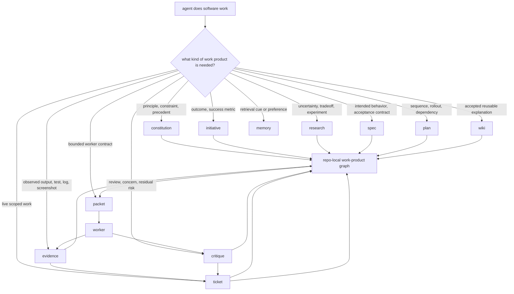

# Agent Loom

Structured paperwork for coding agents.


**Agents do better work when the work has a shape.**

Agent Loom is a Markdown-native paper process for agentic software engineering. It decomposes coding-agent work into typed artifacts: principles, product intent, research, specs, plans, tickets, evidence, critique, reusable knowledge, and bounded handoff packets.

Those artifacts are not passive notes. They are work products the agent has to satisfy.

A model prompted to “fix this” can compress a whole engineering process into one patch. Loom refuses that compression. It makes the agent externalize the engineering work that usually disappears into chat: what is intended, what is known, what is assumed, what was tried, what was observed, what remains doubtful, and why the work can be accepted.

The result is not “more Markdown.”

The result is that the code becomes downstream of explicit, inspectable engineering artifacts.

**The session is disposable. The work products compound.**

[Install Loom](INSTALL.md) · [Read the protocol](PROTOCOL.md) · [Architecture notes](ARCHITECTURE.md)

---

## Quick Navigation

| If you want to know... | Start here |
| --- | --- |
| What Loom is in one screen | [The aha](#the-aha) · [What Loom changes](#what-loom-changes) · [Protocol in one screen](#protocol-in-one-screen) |
| Why this is novel | [The missing middle](#the-missing-middle) · [Templates are reasoning tools](#templates-are-reasoning-tools) · [Why this is not just memory](#why-this-is-not-just-memory) |
| What you actually get | [What you get](#what-you-get) · [Project layers](#project-layers) · [Workflows emerge from the vocabulary](#workflows-emerge-from-the-vocabulary) |
| How to try it quickly | [Try the paper-process demo](#try-the-paper-process-demo) |
| How to install it | [Install](#install) · [INSTALL.md](INSTALL.md) |
| How records and skills fit together | [How Loom works](#how-loom-works) · [The core rule](#the-core-rule) |
| How long-horizon work works | [Tickets, packets, and workers](#tickets-packets-and-workers) · [Fan-out and multiday work](#fan-out-and-multiday-work) |
| How Loom decides work is done | [Done is a property of the graph](#done-is-a-property-of-the-graph) · [Evidence and trust boundaries](#evidence-and-trust-boundaries) |
| How Loom relates to other tools | [Where Loom fits](#where-loom-fits) |
| What ships in this repo | [What ships](#what-ships) · [Skill map](#skill-map) · [Repository layout](#repository-layout) |

<details>
<summary>Full table of contents</summary>

- [The aha](#the-aha)
- [The missing middle](#the-missing-middle)
- [What Loom changes](#what-loom-changes)
- [What you get](#what-you-get)
- [Protocol in one screen](#protocol-in-one-screen)
- [Why this is not just memory](#why-this-is-not-just-memory)
- [Try the paper-process demo](#try-the-paper-process-demo)
- [Install](#install)
- [When Loom pays rent](#when-loom-pays-rent)
- [How Loom works](#how-loom-works)
- [The core rule](#the-core-rule)
- [Project layers](#project-layers)
- [How agents choose work](#how-agents-choose-work)
- [Templates are reasoning tools](#templates-are-reasoning-tools)
- [Tickets, packets, and workers](#tickets-packets-and-workers)
- [Fan-out and multiday work](#fan-out-and-multiday-work)
- [Done is a property of the graph](#done-is-a-property-of-the-graph)
- [Evidence and trust boundaries](#evidence-and-trust-boundaries)
- [Example: a bug fix through Loom](#example-a-bug-fix-through-loom)
- [Research is first-class](#research-is-first-class)
- [Workflows emerge from the vocabulary](#workflows-emerge-from-the-vocabulary)
- [Where Loom fits](#where-loom-fits)
- [Markdown, on purpose](#markdown-on-purpose)
- [What ships](#what-ships)
- [Skill map](#skill-map)
- [Repository layout](#repository-layout)
- [Costs](#costs)
- [The point](#the-point)

</details>

---

## The aha

Most coding-agent failures are not memory failures.

They are process failures.

The agent jumps from prompt to patch with too little explicit intermediate structure. It may have a plan, but the plan is loose. It may have context, but important claims are mixed together in chat. It may run tests, but the evidence is not promoted into anything durable. It may notice a risk, but the risk is not owned by a review artifact. It may discover a useful constraint, but that constraint never becomes part of the project’s working surface.

The diff survives. The engineering work around the diff often does not.

Loom starts from a different premise:

> Coding agents do better work when they are required to produce shaped engineering artifacts, not just final answers.

A behavior question belongs in a spec. A root-cause investigation belongs in research. A live unit of work belongs in a ticket. A test run belongs in evidence. A concern belongs in critique. Accepted understanding belongs in wiki. A bounded worker contract belongs in a packet.

Once those shapes are explicit, the agent is no longer trying to carry the whole job as a conversational blob. It is working through a repo-local graph of typed work products that it can read, update, verify, critique, hand off, and repair.

That is Loom: **artifact-driven software work for coding agents.**

---

## The missing middle

Modern coding agents are strong at answer generation.

Software engineering is not only answer generation.

Real software work passes through intermediate products: problem statements, constraints, intended behavior, rejected approaches, validation results, review findings, risk calls, and decisions about what is accepted. In human teams, some of this lives in issues, design docs, ADRs, tickets, test logs, PR comments, Slack threads, and tribal memory.

With agents, too much of it collapses into a chat transcript.

That collapse is the missing middle:

```text
prompt -> patch
```

Loom expands the middle into named, composable work products:

```text
prompt -> route -> research/spec/plan/ticket -> patch -> evidence -> critique -> promotion -> closure
```

The important move is not that these files can be reread later, although they can. The important move is that the agent had to create them before the work was allowed to collapse into code.

That requirement changes the reasoning path.

Instead of treating the task like a multiple-choice question, the agent is forced into a written exam with sections, receipts, and an acceptance standard. Not hidden chain-of-thought. Not model mysticism. Ordinary engineering artifacts: assumptions, claims, constraints, evidence, critique, and decisions.

Loom is the missing middle between prompt and patch.

---

## What Loom changes

Loom gives agents a structured paper process.

Not bureaucracy for humans. Forms for models.

Each form asks the agent to do a different kind of work:

- specs force intended behavior to become explicit
- research forces uncertainty, tradeoffs, failed paths, and null results to be preserved
- plans force sequencing and dependency structure
- tickets force scope, acceptance, blockers, current state, and closure disposition
- evidence forces observed output to be separated from model claims
- critique forces adversarial review and residual risk to be stated directly
- wiki forces accepted understanding to be promoted instead of rediscovered
- packets force bounded execution contracts for worker loops

A normal chat can contain all of these things, but it does not type them. It does not assign ownership. It does not make status visible. It does not make claims easy to audit. It does not prevent a stale summary from sounding more authoritative than the record it summarized.

Loom gives each kind of work a shape.

That shape becomes a forcing function. The agent has to state the contract, link the evidence, preserve doubt, and reconcile the result. The artifact is both a record and a cognitive scaffold.

Compaction, handoff, model switching, harness switching, and fan-out are downstream benefits. They matter because the work products have already been externalized at full fidelity.

But persistence is not the trick.

**The trick is that artifact generation changes the work.**

---

## What you get

Loom connects several needs that agent workflows usually treat separately.

| Need | What Loom gives the agent | Why it matters |
| --- | --- | --- |
| Better work before code | Templates for specs, research, plans, and tickets | The agent has to make intent, uncertainty, sequence, and scope explicit before the patch hardens |
| Better validation | Evidence records with expected result, actual result, procedure, and source fingerprint | The agent cannot simply assert that work is done; it has to bind claims to observations |
| Better review | Critique records with findings, severity, verdicts, and residual risk | Doubt becomes durable instead of disappearing after the worker that noticed it exits |
| Better closure | Tickets own acceptance disposition and final state | “Done” becomes something the graph can support, not something a model declares |
| Better handoff | Packets compile bounded worker contracts from the graph | Another session, model, harness, or worker gets the right work surface without inheriting all chat noise |
| Better reuse | Wiki and research promotion | Lessons compound instead of being rediscovered on the next pass |
| Better auditability | Stable IDs, frontmatter, status fields, typed links, and owner layers | Humans and agents can inspect why a claim became accepted |

The practical benefit is not that Loom writes more Markdown.

The practical benefit is that Loom makes the agent write the right intermediate artifacts, in the right place, while the work is happening.

When the next worker asks, “What are we doing, why, what supports that, what remains risky, and what can I change?” the answer is not buried in a chat transcript. It is distributed across shaped records that each own one part of the work.

---

## Protocol in one screen

Read this as a placement map, not an execution trace.



The discipline underneath the diagram is simple:

```text
shape the work -> execute a bounded slice -> record evidence -> preserve critique -> reconcile -> promote durable learning
```

The chat remains useful. It is just no longer the only container for the work.

---

## Why this is not just memory

Memory retrieves.

Loom structures.

A memory system might help an agent recall that a test failed, a maintainer prefers a pattern, or a design decision exists. Loom asks different questions:

- What kind of claim is this?
- Which layer owns it?
- Is it intended behavior, observed evidence, review concern, live execution state, accepted knowledge, or merely a retrieval cue?
- What supports it?
- What challenges it?
- What depends on it?
- What can the next worker safely change?
- What would make this work accepted?

That distinction matters because long-running software work needs more than recall. It needs typed authority.

A chat transcript is a chronological mixture of questions, answers, guesses, tool output, stale plans, rejected paths, and partial summaries. It can be useful context, but it is a poor source of truth because it does not tell the agent which claim owns the current state of the work.

Loom does not make a repository “know” anything. It puts explicit work products in the repository and gives agents rules for using them.

You can still keep chat history. Loom does not require artificial amnesia. It simply prevents the important engineering artifacts from existing only inside one session.

That is why compaction and handoff improve. Not because Loom performs magic recall, but because the important parts of the work were already written down in the right shape.

---

## Try the paper-process demo

The fastest way to understand Loom is not to destroy a session for sport.

The fastest way is to compare two runs of the same nontrivial task.

Pick a task with at least one real ambiguity: a behavior question, failed attempt, root-cause uncertainty, migration risk, review concern, partial implementation, or test failure.

Run it once as ordinary prompt-to-patch work.

Then run it through Loom:

```text
Use Loom for this task. Before changing code, route the work into the right project records. Make the patch downstream of the records, then record evidence and critique before closure.
```

Watch for the difference that matters:

- Did the agent clarify intended behavior before coding?
- Did it separate unknowns from assumptions?
- Did it preserve rejected approaches or null results?
- Did the ticket define acceptance before the final answer?
- Did evidence capture what actually happened?
- Did critique surface a risk the first run smoothed over?
- Did the final patch become easier to review because the work around it had structure?

That is the core demo.

A second demo can show the downstream benefit:

1. Let Loom create or update the relevant records while ordinary work is happening.
2. Stop the session, compact context, switch models, switch harnesses, or hand the ticket to another worker.
3. Continue from the project records.

In a skills-aware harness, you usually should not need magic words. If a cold session does not route automatically, a nudge is fine:

```text
Use loom-bootstrap, then continue from the project records.
```

The point is not that a worker can survive without chat history.

The point is that the work no longer depends on one chat being treated like a pet.

---

## Install

Loom installs as a skills package. The fastest path is to expose `skills/` to your coding harness.

```bash
git clone https://github.com/z3z1ma/agent-loom.git
```

First-class harness instructions are in [INSTALL.md](INSTALL.md):

- Claude Code
- OpenCode
- Codex
- Cursor
- Gemini CLI
- generic skills-directory install

After install, work normally. Loom is designed to be discovered by the agent when the work calls for it.

Explicit prompts are escape hatches, not the main UX. They are useful when you want to prod a cold session, force repair, or make the owner/workflow choice visible:

```text
Use loom-bootstrap, then continue from the project records.
```

```text
Use loom-records to inspect the graph and repair any broken links before continuing.
```

```text
Use Loom for this task. Route the work through the right records before editing code.
```

---

## When Loom pays rent

Loom is overkill for a one-line edit.

Use the source tree and Git when the work is tiny, local, obvious, and disposable.

Loom starts paying for itself when work crosses any of these boundaries:

- intended behavior is unclear
- implementation risk is nontrivial
- the task needs research
- the task changes architecture or product semantics
- the agent will run tests or collect evidence worth preserving
- review concerns should survive the moment they are noticed
- work may cross sessions, models, harnesses, or days
- several workers may touch related scope
- the result should teach the project something reusable

The principle is:

```text
minimum durable state, maximum recoverability
```

Create enough graph for the work to recover, audit, and compound. Do not create a shrine around every keystroke.

---

## How Loom works

Loom has two complementary loops.

The **work-product loop** teaches the agent where each kind of engineering artifact belongs:

```text
constitution -> initiative -> research/spec -> plan -> ticket -> evidence -> critique -> wiki
```

The exact path depends on the work. A small bug may go directly through evidence and a ticket. A large feature may need initiative framing, research, spec, plan, several tickets, implementation packets, evidence, critique, and promotion.

The **worker loop** compiles a bounded packet when another session, model, harness, worktree, or child worker should perform a slice:

```text
goal + read scope + write scope + source fingerprint + verification posture + stop conditions + output contract
```

The worker performs one bounded slice. The parent reconciles what happened back into tickets, evidence, critique, research, specs, plans, wiki, constitution, or initiatives as appropriate.

No hidden database. No daemon. No SaaS. No special runtime required.

Just Markdown records the agent can read, write, diff, review, link, and repair.

---

## The core rule

```text
placement beats recency
```

The newest chat message does not win. The longest summary does not win. The most confident model output does not win. The right record owns the claim.

For software work:

- the source tree owns implementation reality
- Git owns file history
- constitution records own durable principles and hard constraints
- initiatives own strategic outcomes and success framing
- research records own investigations, tradeoffs, experiments, rejected paths, and null results
- specs own intended behavior and acceptance contracts
- plans own sequencing and rollout strategy
- tickets own live execution state and acceptance disposition
- evidence owns observed validation
- critique owns adversarial review and residual risk
- wiki owns accepted reusable explanation
- memory can support retrieval cues, preferences, reminders, and pointers without owning project truth

This is the difference between a helpful note and a reliable work surface.

---

## Project layers

Loom separates project state into canonical owner layers and durable support surfaces.

Canonical owner layers own durable project work products:

| Layer | What goes there |
| --- | --- |
| `constitution` | Durable identity, principles, hard constraints, precedent, roadmap direction |
| `initiative` | Strategic outcomes, success metrics, cross-cutting result framing |
| `research` | Investigations, tradeoffs, experiments, rejected paths, null results, evidence synthesis |
| `spec` | Intended behavior, requirements, scenarios, acceptance contracts |
| `plan` | Execution strategy, decomposition, sequencing, rollout |
| `ticket` | Live execution state, scoped work, blockers, acceptance disposition, closure |
| `evidence` | Observed artifacts, validation output, reproduction steps, logs, screenshots, scan results |
| `critique` | Adversarial findings, review verdicts, residual risk |
| `wiki` | Accepted explanation, architecture concepts, reusable workflow knowledge |

Durable support surfaces help execution and recovery without owning project truth:

| Surface | What goes there |
| --- | --- |
| `packet` | Bounded worker contracts; durable support, not project truth |
| `memory` | Optional support recall: retrieval cues, preferences, entities, reminders, and hot context |
| `support` | Optional saved support artifacts such as drive handoffs; not canonical truth |

Workspace and harness metadata, such as `.loom/workspace.md` and `.loom/harness.md`, are also support metadata. They help entry, owner selection, and environment recovery, but they do not own project truth.

The layers are ordinary Markdown records inside the repo. They are structured enough for agents to reason over and simple enough for humans to inspect.

---

## How agents choose work

The agent starts by asking one question:

**What kind of work product is needed?**

Use this table as orientation, not as a script to dump into records.

| Situation | Loom owner or workflow |
| --- | --- |
| Missing understanding | `research` |
| Unclear intended behavior | `spec` |
| Unclear sequencing | `plan` |
| Live scoped work | `ticket` |
| Observed output or validation | `evidence` |
| Review pressure, concern, or residual risk | `critique` |
| Stable accepted understanding | `wiki` |
| Bounded implementation pass | Ralph with a Ralph packet |
| Retrieval cue, preference, reminder, or hot context | Support recall; promote it if it becomes durable truth |

A vague bug report can become reproduction evidence, root-cause research, a tightened spec if behavior is ambiguous, a ticket for the fix, a packet for the implementation pass, green evidence, critique when risk warrants, and wiki promotion if the lesson should survive.

No new workflow had to be invented. The agent used the graph.

---

## Templates are reasoning tools

Loom records are not documentation after the fact.

They are interfaces the agent must satisfy while doing the work.

A ticket template asks for scope, acceptance, blockers, links, verification posture, and closure disposition. A research template asks for questions, options, experiments, rejected paths, null results, and evidence. An evidence template separates expected output from actual output. A critique template forces findings, verdicts, severity, and residual risk to be stated directly.

That is why the Markdown shape matters.

The template slows the agent down at the exact point where fast guessing is expensive. It turns “I think this is fine” into a more inspectable sequence:

```text
what is the intended behavior?
what do we know?
what are we assuming?
what changed?
what did we observe?
what still deserves doubt?
what can be accepted?
what should be promoted?
```

A record usually carries four kinds of structure:

```text
frontmatter  -> identity, type, status, links, timestamps, retrieval cues
purpose      -> why this record exists
body         -> the claim, work, observation, or judgment
links        -> what this record depends on, supports, challenges, or promotes
```

This turns much of agentic software work into ordinary operations over durable, shaped project objects.

Create the right object. Read the upstream graph. Update the claim with evidence. Preserve doubt. Close or promote when the graph is consistent.

That sounds almost too obvious.

That is the point.

---

## Tickets, packets, and workers

Loom treats live work as a ledger and bounded execution as a contract.

A **ticket** is the only live execution ledger. It owns scope, blockers, acceptance criteria, current state, and closure.

A **packet** is a compiled contract for a worker. It is built from the upstream graph: relevant constitution records, initiative context, research, spec, plan, ticket, evidence, critique, source fingerprint, execution context, write scope, verification posture, stop conditions, and output contract.

The worker gets less context by volume, but better context by shape.

A strong packet states:

- the ticket or project record being served
- the bounded goal for this iteration
- what the worker may read
- what the worker may write
- the source fingerprint
- the Git branch or worktree context when files will change
- the verification posture
- stop conditions
- the output contract
- what the parent will do after return

Packets prevent context drift, hidden assumptions, uncontrolled changes, and scope creep.

A packet is not the project record. After the worker returns, the parent reconciles the result into tickets, evidence, critique, research, specs, plans, wiki, constitution, or initiatives as needed.

This is where “sessions like cattle, not pets” becomes practical. The session can be useful, rich, and long-lived. It just stops being sacred.

---

## Fan-out and multiday work

Long-horizon work is not bolted onto Loom. It is one of the reasons Loom exists.

When tickets and packets live out of band from the active chat, a human or parent agent can build a real backlog, split work into bounded slices, hand those slices to workers, and reconcile the results back into the same graph.

That enables patterns like:

- a backlog of scoped tickets that can survive days of work
- non-overlapping packets for parallel workers or worktrees
- one parent session that integrates child results instead of doing every mutation itself
- evidence records that prove what each worker actually observed
- critique records that let review survive the worker that produced the code
- wiki and research promotion so durable learning compounds instead of being rediscovered

A clean worker loop is powerful because the child starts without the parent’s context pollution. Loom adds the missing discipline around that loop: packets, evidence, critique, reconciliation, and promotion.

The parent does not ask, “Did the child say it was done?”

The parent asks, “What changed in the graph, and is the graph now consistent?”

---

## Done is a property of the graph

Work is not done when the code compiles.

Work is not done when a worker says “done.”

Work is not done just because a test is green.

Work is done when the project work products support the claim being made.

For software work, closure usually requires:

- the relevant spec is satisfied, or ticket-local acceptance criteria are explicit
- evidence supports the claim being made
- critique is resolved, accepted, or recorded as residual risk
- the ticket reflects the actual final state
- durable learning has been promoted when it should survive the task

A commit is not enough if the ticket still lies.

**Done is a property of the graph.**

---

## Evidence and trust boundaries

The model can predict that work is done.

It cannot make done true.

Loom makes verification explicit by separating claims from evidence and evidence from acceptance.

A strong evidence record should preserve enough detail for a future worker to inspect or reproduce the claim:

- command or procedure
- environment when relevant
- source fingerprint or commit
- expected result
- actual result
- exact output excerpt or artifact path
- screenshot, log, trace, scan, or test identity when useful
- whether the evidence supports, challenges, or only partially supports the claim

Loom also treats untrusted input as input, not truth.

External docs, web pages, generated files, tool output, and model-written summaries can inform research, evidence, critique, and tickets. They do not promote themselves into canonical truth. Promotion requires placement, judgment, and reconciliation through the owning layer.

---

## Example: a bug fix through Loom

A non-trivial bug fix usually follows this spine:

```text
route -> shape -> ready -> execute -> reconcile -> verify -> critique -> accept -> promote -> close
```

1. Capture reproduction evidence.
2. Research the root cause if it is unknown.
3. Update or create a spec if intended behavior is fuzzy.
4. Create or tighten the ticket.
5. Compile a Ralph packet or bounded implementation packet for one pass.
6. Run the worker or perform the local edit.
7. Record red and green evidence.
8. Route critique when risk warrants.
9. Accept only when the ticket reflects reality.
10. Promote durable learning into research, wiki, spec, plan, initiative, constitution, or evidence; leave support-only recall, reminders, preferences, or owner-record pointers in memory when useful.
11. Close when the graph is consistent.

The same pattern works for features, spikes, reviews, refactors, migrations, codebase mapping, release preparation, and cleanup work that spans more than one sitting.

The point is not ceremony.

The point is that each step leaves behind the artifact that the next step should depend on.

---

## Research is first-class

A lot of software work is knowledge work before it is code.

Agents explore libraries, inspect implementation paths, test approaches, compare options, discover constraints, and learn that something does not work. If that work stays in scratch files or short-lived context, the next session repeats it.

Research gives that work a durable place: questions, options, experiments, rejected approaches, null results, supporting evidence, open questions, and evidence-grounded recommendations.

A failed path can be valuable. A null result can be the most important thing the project learned that day.

This is where Loom crosses from coding workflow into knowledge-work protocol.

---

## Workflows emerge from the vocabulary

Workflow skills coordinate work through existing owner layers. They do not create ledgers or new owner layers.

```text
brainstorm:
workspace problem shaping -> research/spec as needed -> plan -> ticket

test-first implementation:
ticket -> packet with verification_posture:test-first -> red evidence -> green evidence -> ticket acceptance

debug:
evidence -> root-cause research -> spec if needed -> ticket -> local edit or packet -> evidence -> critique -> retrospective

spike:
research -> throwaway scope if needed -> evidence -> conclusions/null results -> downstream spec, plan, ticket, or wiki

code map:
scan evidence -> research where structure is uncertain -> wiki atlas when accepted

review:
critique -> evidence -> ticket reconciliation -> acceptance or repair

parallel execution:
plan execution waves -> non-overlapping tickets/packets/worktrees -> child results -> parent integration evidence -> reconciliation

git isolation:
ticket/packet scope -> explicit baseline -> branch/worktree -> diff provenance -> handoff evidence

implementation:
ticket -> packet -> worker -> evidence -> reconcile

ship:
ticket/evidence/critique/promotion disposition -> PR summary, release note, risk summary, follow-up list

retrospective:
ticket or initiative lessons -> wiki, research, spec, plan, initiative, constitution, or evidence; memory cleanup may leave support-only recall or pointers
```

You do not invent a workflow every time. You route through the project graph.

---

## Where Loom fits

The agent-tooling ecosystem is converging on a few good ideas: skills teach agents reusable workflows, `AGENTS.md` gives agents a predictable instruction surface, spec-driven tools make intent explicit, task graphs keep work decomposed, and worker loops reduce context pollution.

Loom is the work-product graph underneath those ideas.

| Adjacent idea or tool | Primary contribution | How Loom relates |
| --- | --- | --- |
| [AGENTS.md](https://agents.md/) | A predictable README-like instruction file for coding agents | Loom complements static instructions with live, typed project records |
| [Agent Skills](https://agentskills.io/home), [Claude Code skills](https://code.claude.com/docs/en/skills), [Codex skills](https://developers.openai.com/codex/skills) | Reusable instruction packages that teach agents how to do specific work | Loom is delivered as skills, but the skills teach a project-state protocol rather than one narrow task |
| [Spec Kit](https://github.com/github/spec-kit) | Specification-driven development with product scenarios and predictable outcomes | Loom treats specs as one owner layer beside research, tickets, evidence, critique, plans, and wiki |
| [Beads](https://github.com/gastownhall/beads) | A persistent, dependency-aware task graph for coding agents | Loom includes tickets, but broadens the graph to intent, behavior, research, validation, review, and durable knowledge |
| [Agent OS](https://github.com/buildermethods/agent-os) | Standards, better spec shaping, and agent alignment | Loom can preserve standards and decisions, then connect them to tickets, evidence, critique, and accepted project knowledge |
| [BMAD Method](https://github.com/bmad-code-org/BMAD-METHOD) | Structured workflows and specialized agent collaboration across the lifecycle | Loom gives cross-role work a common record form and reconciliation layer |
| [Ralph](https://github.com/snarktank/ralph) | Fresh-context worker loops for autonomous coding iterations | Loom turns worker execution into packet, evidence, critique, parent reconciliation, and promotion |

Loom is not trying to replace every workflow project.

It is the source-of-truth layer that lets many workflows leave behind durable, inspectable project work products.

The short version:

```text
skills teach behavior
specs clarify intent
tickets bound execution
evidence proves observations
critique preserves doubt
wiki compounds learning
packets move work between workers
Loom gives all of them one graph
```

---

## Markdown, on purpose

Loom is Markdown-native.

No service. No daemon. No hidden runtime database.

The graph is files. Agents already know how to search with `rg`, traverse with `find`, inspect with `cat`, compare with `git diff`, edit records, move files, and compose shell tools with `awk`, `sed`, `xargs`, and pipes.

That is enough.

Markdown also matters because humans can inspect it. A record that cannot be reviewed by a maintainer is not a good trust boundary. A record that cannot be diffed is hard to govern. A record that requires a service to explain itself is no longer repo-local.

Optional utilities may validate, project, or summarize state. They do not define Loom semantics.

Harness adapters may preload bootstrap references where a harness supports it cleanly. That is an adapter optimization over the same skill package, not a second doctrine source.

The protocol is the corpus.

---

## What ships

This repository ships the Loom skill package.

The package product surface is the top-level `skills/` corpus. Support docs, harness manifests/adapters, examples, packaging files, packets, memory, and saved support artifacts may explain, transport, validate, or recover Loom work; they do not own protocol truth.

It is not a runtime, service, daemon, MCP server, product CLI, workflow engine, hidden database, or prompt dump.

Included:

- `skills/`, the package product surface and canonical Loom skill corpus
- `loom-bootstrap`, the entry skill that anchors the rest of the package
- project-owner skills for constitution, initiatives, research, specs, plans, tickets, evidence, critique, and wiki
- the `loom-memory` support skill for optional recall without shadow truth
- workflow skills for workspace entry, records, `loom-drive` objective/workflow driving, Ralph, Git, debugging, spike, codemap, ship, retrospective, and skill authoring
- templates and references for Markdown-native operation
- harness manifests and adapters as install/transport support, not doctrine sources
- `PROTOCOL.md`, the stable protocol summary, not a separate product surface
- `ARCHITECTURE.md`, implementation and package architecture notes for maintainers
- packaging files and repository metadata for distribution and maintainer workflows
- internal examples and fixtures for maintainer review, not product-surface guidance or protocol truth

The product surface is `skills/`: the skills are the protocol in operational form.

---

## Skill map

| Skill | Role |
| --- | --- |
| `loom-bootstrap` | Entry doctrine and Loom operating posture; usually reached automatically through skills |
| `loom-workspace` | Workspace entry, structure check, first owner/workflow decision |
| `loom-records` | IDs, frontmatter, typed links, status, validation, repair |
| `loom-constitution` | Project identity, constraints, decisions, roadmap direction |
| `loom-initiatives` | Strategic outcomes and success framing |
| `loom-research` | Reusable discovery, experiments, tradeoffs, null results |
| `loom-specs` | Intended behavior and acceptance contracts |
| `loom-plans` | Sequencing, decomposition, rollout strategy |
| `loom-tickets` | Live execution ledger and acceptance gate |
| `loom-evidence` | Observed artifacts and claim support or challenge |
| `loom-critique` | Adversarial review, findings, verdicts, residual risk |
| `loom-wiki` | Accepted explanation and reusable understanding |
| `loom-memory` | Support recall, retrieval cues, preferences, and reminders without shadow truth |
| `loom-drive` | Objective and workflow coordination that routes work through owner layers without owning project truth |
| `loom-ralph` | Bounded fresh-context implementation loop |
| `loom-git` | Implementation isolation, baseline, branch/worktree provenance |
| `loom-debugging` | Reproduce-first debug workflow through existing layers |
| `loom-spike` | Bounded investigation and sketch workflow through research and evidence |
| `loom-codemap` | Repository atlas workflow through evidence, research, and wiki |
| `loom-ship` | PR, release, handoff, risk, and follow-up packaging |
| `loom-retrospective` | Compounding pass that promotes accepted learning into project layers |
| `loom-skill-authoring` | Maintaining Loom-compatible skills without breaking the protocol |

---

## Repository layout

```text
.
├── README.md
├── INSTALL.md
├── PROTOCOL.md
├── ARCHITECTURE.md
├── AGENTS.md
├── examples/             # internal fixtures and traces, not product surface or project records
├── optional-utilities/   # helpers that do not define semantics
└── skills/               # canonical Loom skill package
```

Inside a Loom-enabled project, the runtime tree looks roughly like this:

```text
.loom/
├── workspace.md        # optional workspace metadata; support, not project truth
├── harness.md          # optional harness metadata; support, not project truth
├── constitution/
│   ├── constitution.md
│   ├── decisions/
│   └── roadmap/
├── initiatives/
├── research/
├── specs/
├── plans/
├── tickets/
├── critique/
├── wiki/
├── packets/
│   ├── ralph/
│   ├── critique/
│   └── wiki/
├── evidence/
├── memory/        # optional support recall
│   ├── system/
│   └── user/
└── support/       # optional saved support artifacts; non-canonical
    └── drive-handoffs/
```

First records usually emerge through `loom-workspace`, `loom-constitution`, and `loom-tickets`.

---

## Costs

Loom asks for discipline.

That is the trade.

Broken links matter. Stale records matter. Evidence that overclaims matters. A ticket that says the work is accepted when critique is unresolved is worse than no ticket at all.

Loom also has a threshold. Do not create a graph-shaped shrine around a one-line edit.

The graph pays for itself when work crosses sessions, changes behavior, needs review, involves research, carries risk, requires handoff, prepares future work, or leaves behind knowledge the next worker would otherwise rediscover.

The failure mode to guard against is a second junk drawer.

Loom only works when records stay small enough to inspect, linked enough to recover, and honest enough that a future worker can trust them.

This is why the protocol keeps returning to placement. A bad record in the wrong layer is not rigor. It is just durable confusion.

---

## The point

Loom is not a bigger prompt.

It is not a memory feature.

It is not a way to keep one agent session alive forever.

It is not documentation theater.

Loom is a Markdown-native paper process for coding agents.

It decomposes agentic software work into typed artifacts and gives each artifact a job. The agent has to externalize the work: intent, uncertainty, scope, implementation state, evidence, critique, accepted knowledge, and handoff contracts.

That changes how the agent codes.

The artifacts also survive stopped sessions, context compaction, model switches, harness switches, worker handoff, fan-out, and time. But that durability is the consequence, not the pitch.

The pitch is simpler:

```text
prompt-to-patch is too thin
agents need forms
the forms create work products
the work products compose
the code becomes downstream of process
the session becomes disposable
the graph compounds
```

The pieces already existed. Loom gives each one a shape.
