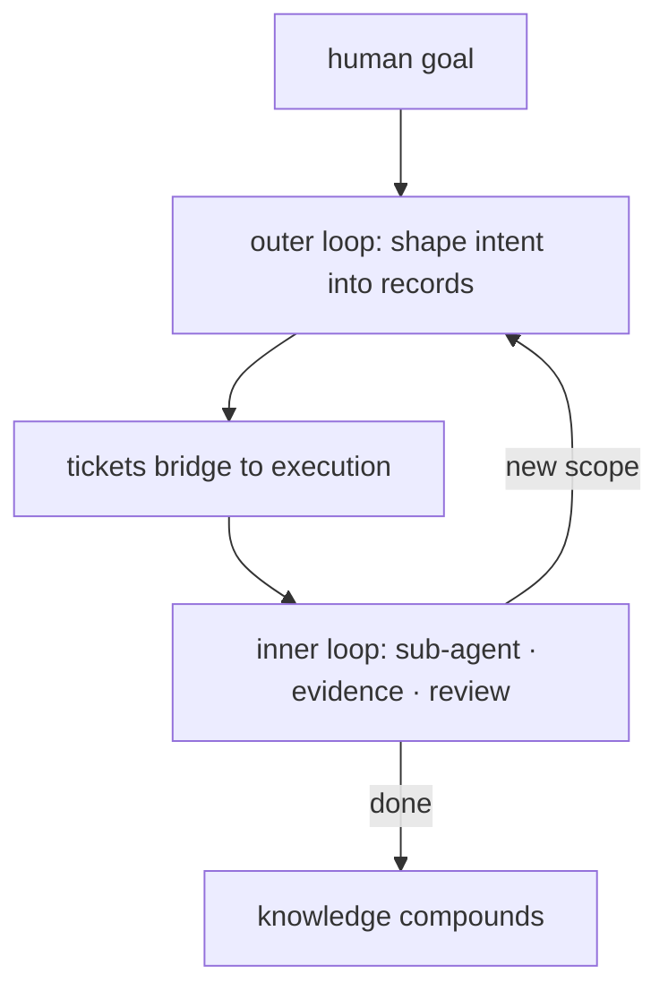
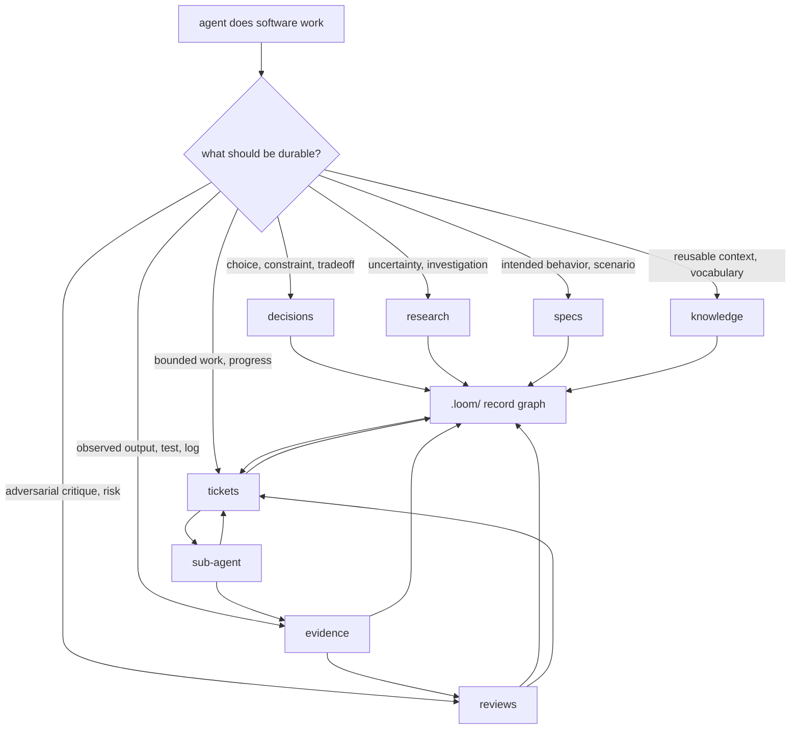

# Agent Loom

The missing middle between prompt and patch.


**Coding agents do better work when the work has a shape.**

AI agents can write patches. The surrounding engineering work often stays in
chat: intent, uncertainty, scope, evidence, review, handoff, and lessons learned.

Agent Loom gives that work a repo-local shape. It turns a coding session into
Markdown records: decisions, research, specs, tickets, evidence, reviews, and
knowledge.

The loop is deliberate: shape vague work with the human before building, decompose
complex work into parent/child tickets, execute through focused sub-agents, and
claim only what evidence and reviews support.

**The session is disposable. The work products compound.**

[Protocol](PROTOCOL.md)

## The Idea

Most agent failures around serious code are process failures. The model jumps
from prompt to patch while the important engineering work stays in chat.

Loom makes the agent externalize that work while it happens:

- what behavior is intended
- what is uncertain
- what is in scope
- what was tried
- what was observed
- what a review challenged
- what future work should reuse

Those records live in `.loom/`. The agent can read them, update them, link them,
hand them to a sub-agent, and continue after context is gone.

The forms are for the model. Humans get the trail.

## Try It

Copy [`PROTOCOL.md`](PROTOCOL.md) into your project's `AGENTS.md`, `CLAUDE.md`, or
equivalent. Start working with your coding agent. Records appear in `.loom/` as the
agent works.

Or install via the skills ecosystem (supports 70+ coding agents):

```bash
npx skills add z3z1ma/agent-loom
```

## Installing

### Copy-Paste (Recommended)

Copy the contents of [`PROTOCOL.md`](PROTOCOL.md) into your project's agent
instructions file:

| Harness | File |
| --- | --- |
| OpenCode | `AGENTS.md` |
| Claude Code | `CLAUDE.md` |
| Cursor | `.cursor/rules/loom.md` or project rules |
| Codex | `AGENTS.md` |
| Gemini CLI | `GEMINI.md` |
| Others | Whatever file your agent reads for instructions |

This is the most portable approach. No dependencies, no tooling, works everywhere.

### Skills Ecosystem

```bash
npx skills add z3z1ma/agent-loom
```

Uses the [Vercel skills CLI](https://github.com/vercel-labs/skills) to install the
Loom skill into your agent's skill directory. Supports 70+ coding agents including
OpenCode, Claude Code, Codex, Cursor, Gemini CLI, GitHub Copilot, Windsurf, Roo
Code, and many more.

```bash
# Install globally (available across all projects)
npx skills add z3z1ma/agent-loom -g

# Install to specific agents
npx skills add z3z1ma/agent-loom -a claude-code -a opencode

# Non-interactive
npx skills add z3z1ma/agent-loom -g -a claude-code -y
```

### First-Class Harness Support

This repo ships native plugin manifests for direct marketplace install:

| Harness | Install |
| --- | --- |
| Claude Code | `claude plugin marketplace add z3z1ma/agent-loom` |
| Cursor | Install from Cursor marketplace or `git clone` to `~/.cursor/plugins/local/agent-loom` |
| Gemini CLI | `gemini extensions install https://github.com/z3z1ma/agent-loom` |
| Codex | `codex plugin marketplace add z3z1ma/agent-loom` |
| OpenCode | Add `"@z3z1ma/agent-loom"` to your config plugins |

### After Installation

The protocol teaches the agent the full workflow. Start with a natural prompt:

```text
Let's shape this feature before building it.
```

Records appear in `.loom/` as the agent works.

## The Shape



Two loops, one bridge. The outer loop shapes vague intent into concrete records.
The inner loop executes bounded tickets and produces evidence that reviews
challenge. Discoveries cycle back. Knowledge compounds across sessions.

Tiny work can stay tiny. The graph pays for itself when work has ambiguity,
risk, handoff, review pressure, or future value.

## What Changes

Loom forces useful friction at the exact points where agents usually blur things:

- the outer loop makes shaping the first action, not an afterthought
- specs keep intended behavior out of implementation guesses
- tickets keep scope, acceptance, and progress in one place
- evidence keeps observations separate from model claims
- reviews give important claims an adversarial challenge
- knowledge keeps accepted lessons searchable
- sub-agents stay bounded while tickets carry the durable context

## The Record Surfaces

| Surface | Job |
| --- | --- |
| decisions | durable choices, constraints, tradeoffs, ADR format |
| research | investigations, sources, dead ends, conclusions |
| specs | intended behavior, requirements, scenarios, interfaces |
| tickets | bounded work, scope, acceptance, progress, closure |
| evidence | observed facts, outputs, reproductions, screenshots, logs |
| reviews | adversarial critique, findings, verdicts, residual risk |
| knowledge | shared vocabulary, conventions, procedures, troubleshooting |



## When It Helps

Use Loom when the work should be recoverable:

- behavior changes where intent matters
- bugs that need reproduction or root-cause work
- multi-step changes that decompose into parent/child tickets
- tasks that may cross sessions, models, or harnesses
- work that needs tests, screenshots, logs, or other durable evidence
- review findings or residual risk that should survive the current chat
- lessons future agents should reuse

For a one-line obvious edit, use the source tree and Git.

## Loom Mill

Loom Mill is a companion application that provides a visual interface for the
`.loom/` record graph — shaping sessions, ticket visualization, and execution
observation. It reads and writes the same Markdown records the protocol defines.

See [`loom-mill/`](loom-mill/) for details.

## Repository Layout

```
.
├── PROTOCOL.md              — the protocol (copy into your harness instructions)
├── skills/loom/SKILL.md     — same protocol, packaged as a skill
├── .claude-plugin/          — Claude Code marketplace manifest
├── .cursor-plugin/          — Cursor marketplace manifest
├── .agents/plugins/         — Codex/OpenCode marketplace manifest
├── gemini-extension.json    — Gemini CLI extension manifest
├── loom-mill/               — companion visual application
└── .loom/                   — dogfood records for this repo
```

## For Agents

If you are a coding agent reading this README (e.g. because a user asked you to
install or set up Loom), here is what to do:

1. **Preferred**: Copy the contents of `PROTOCOL.md` from this repo into the
   project's agent instructions file (`AGENTS.md`, `CLAUDE.md`, or equivalent).

2. **Alternative**: Run `npx skills add z3z1ma/agent-loom` to install the Loom
   skill via the skills ecosystem. This places the protocol into your skill
   directory automatically.

3. **After install**: The protocol is self-contained. Once loaded, follow it. Start
   by reading any existing `.loom/` directory in the project. If none exists, begin
   the outer loop when the user's next request has ambiguity worth capturing.

## The Short Version

Prompt-to-patch is too thin for serious software work.

Loom gives coding agents forms for the parts that usually disappear: intent,
scope, evidence, review, handoff, and reusable knowledge.

The code can change hands. The work can continue.
