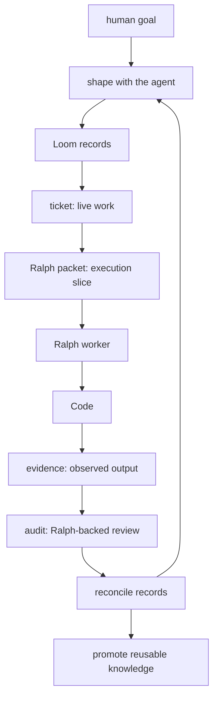
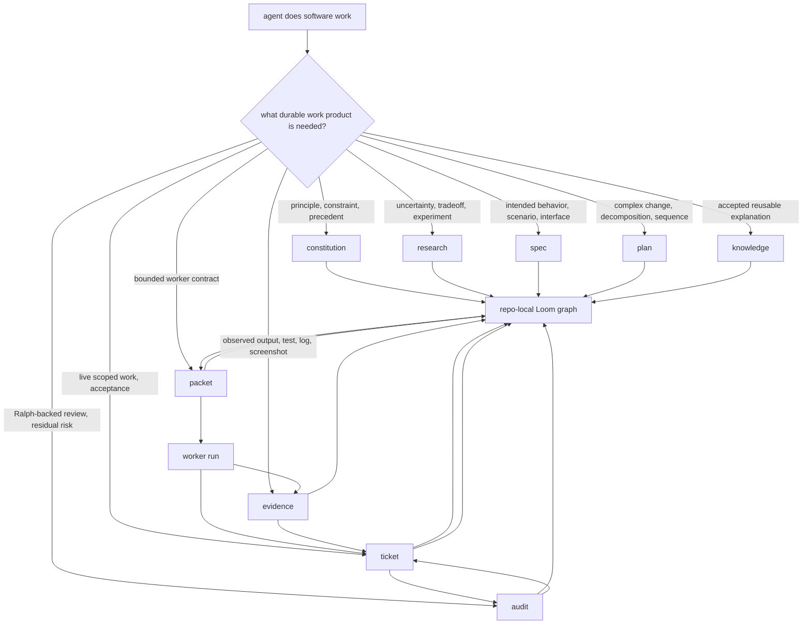

# Agent Loom

The missing middle between prompt and patch.


**Coding agents do better work when the work has a shape.**

AI agents can write patches. The surrounding engineering work often stays in
chat: intent, uncertainty, scope, evidence, review, handoff, and lessons learned.

Agent Loom gives that work a repo-local shape. It turns a coding session into
Markdown records: specs, tickets, research, evidence, audit, knowledge, and
bounded worker packets.

The loop is deliberate: shape vague work with the human before building, slice
complex work into ticket-ready units, hand bounded worker runs through Ralph
packets, and claim only what evidence and audit support.

Activation is deliberate too. `using-loom` is not just a file to preload; it is the
first-action doctrine that makes the agent check the owning Loom surface or skill
before answering, inspecting, editing, creating tickets, or launching workers when
there is any material chance Loom applies.

Unless the ask is already concrete enough for execution, Loom's first job is
outer-loop judgment: select direction, draw boundaries, expose system seams and
state relationships, and preserve what makes the design coherent.

**The session is disposable. The work products compound.**

[Install](INSTALL.md) / [Protocol](PROTOCOL.md) / [Architecture](ARCHITECTURE.md) / [Core](loom-core/README.md) / [Playbooks](loom-playbooks/README.md)

## The Idea

Most agent failures around serious code are process failures. The model jumps
from prompt to patch while the important engineering work stays in chat.

Loom makes the agent externalize that work while it happens:

- what behavior is intended
- what is uncertain
- what is in scope
- what was tried
- what was observed
- what a Ralph reviewer challenged
- what future agents should reuse

Those records live in `.loom/`. The agent can read them, update them, link them,
hand them to another worker, and continue after context is gone.

The forms are for the model. Humans get the trail.

## The Shape



Read the chart as a recovery path. Tiny work can stay tiny. The graph pays for
itself when work has ambiguity, risk, handoff, review pressure, or future value.

## What Changes

Loom forces useful friction at the exact points where agents usually blur things:

- `using-loom` makes skill and surface routing the first action, not an afterthought
- specs keep intended behavior out of implementation guesses
- tickets keep live execution state and acceptance in one place
- evidence keeps observations separate from model claims
- audit gives important claims a Ralph-backed challenge
- packets keep ticket execution and worker runs bounded
- knowledge keeps accepted lessons searchable

Meaningful closure needs graph support: ticket state, evidence, audit, and the
records that own behavior or judgment.

A normal bug fix might leave only a diff and a final answer. Through Loom, the
same work can leave reproduction evidence, root-cause research, a scoped ticket,
green evidence, review findings, and a troubleshooting note future agents will
find before repeating the diagnosis.

You get the fix and the trace.

## The Core Surfaces

| Surface | Job |
| --- | --- |
| constitution | durable project judgment, policy, constraints, ADRs, roadmap direction |
| tickets | bounded executable work, live state, acceptance, closure |
| research | investigations, tradeoffs, rejected paths, null results, conclusions |
| specs | intended behavior, requirements, scenarios, interfaces |
| plans | strategy for complex work that needs several ticket-ready units |
| evidence | observed facts, outputs, reproductions, screenshots, logs, validation |
| audit | Ralph-backed review, findings, verdicts, residual risk |
| knowledge | preferences, procedures, accepted explanations, atlases, retrieval cues |
| packets | bounded worker contracts under `.loom/packets/ralph/` |

Retrospective is a promotion pass over those surfaces. It has no directory of its
own.



## When It Helps

Use Loom when the work should be recoverable:

- behavior changes where intent matters
- bugs that need reproduction or root-cause work
- migrations, refactors, architecture changes, and rollout plans
- tasks that may cross sessions, models, harnesses, or worktrees
- work that needs tests, screenshots, logs, or other durable evidence
- review findings or residual risk that should survive the current chat
- lessons future agents should reuse

For a one-line obvious edit, use the source tree and Git.

## Try It

Clone the repo:

```bash
git clone https://github.com/z3z1ma/agent-loom.git
```

Install Core first. Add Playbooks if you want routes for debugging, TDD, review,
migrations, UI verification, shipping, and similar work.

See [INSTALL.md](INSTALL.md) for OpenCode, Claude Code, Codex, Cursor, Gemini CLI,
and generic skill-directory setup.

Once Core is visible to your harness, start with a real task:

```text
Use using-loom. Route this task through the smallest Loom surface that makes the work recoverable. Shape first, then execute, then record evidence and audit if the claim needs it.
```

Some adapters preload `using-loom`. If they do, continue straight into the work.

Core also ships Loom Weaver as an optional explicit shaping persona. Use it when
you want pre-implementation Loom shaping, options, recommendations, and `.loom/`
records without source edits. See [INSTALL.md](INSTALL.md) for harness-specific
invocation syntax.

## What Ships

| Package | Role |
| --- | --- |
| `loom-core/` | mandatory `using-loom` doctrine, record skills, templates, references, optional Loom Weaver, and adapter surfaces |
| `loom-playbooks/` | optional workflow-specific skills that route through Loom surfaces |

The required package carries the operating doctrine and record skills. Optional
workflow-specific skills help after the agent has shaped the next move and knows
which Loom surface owns it.

There is no daemon, database, dashboard, required MCP server, product CLI, or
hidden runtime. Markdown is the work surface because humans and agents can inspect
it with ordinary tools.

## Repository Layout

```text
.
|-- README.md
|-- INSTALL.md
|-- PROTOCOL.md
|-- ARCHITECTURE.md
|-- loom-core/
|   |-- agents/
|   |-- skills/
|   |-- hooks/
|   |-- loom-core.mjs
|   `-- package.json
|-- loom-playbooks/
|   |-- skills/
|   |-- loom-playbooks.mjs
|   `-- package.json
|-- evals/
`-- .loom/
```

`evals/` holds internal review fixtures. `.loom/` holds dogfood records for
this repo. The product surface remains `loom-core/skills`, `loom-core/agents`,
`loom-core/codex/agents`, and `loom-playbooks/skills`.

## The Short Version

Prompt-to-patch is too thin for serious software work.

Loom gives coding agents forms for the parts that usually disappear: intent,
scope, evidence, review, handoff, and reusable knowledge.

The code can change hands. The work can continue.
