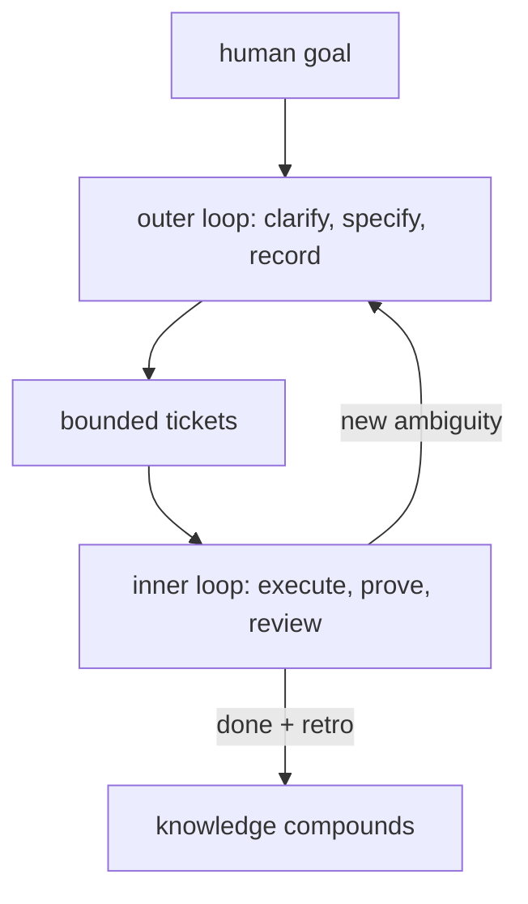

<p align="center">
  
</p>

<h1 align="center">10x</h1>

<p align="center">
  <em>An opinionated instruction set that makes AI coding agents clarify, remember, verify, and improve across sessions.</em>
</p>

<p align="center">
  
  
  
  
  
</p>

---

10x is a drop-in Markdown instruction set for AI coding agents.

It is one self-contained file: [`SKILL.md`](SKILL.md). Load it into Codex,
OpenCode, Claude Code, Cursor, Gemini CLI, or any harness that reads project
instructions. It teaches the agent to:

- challenge vague work before coding;
- preserve repo-local context in `.10x/`;
- split discovery from execution;
- prove changes with evidence and review;
- turn mistakes, dead ends, and repeated friction into reusable knowledge.

Try it in 60 seconds, either way:

**Skills CLI**

```bash
npx skills add z3z1ma/10x
```

**Copy-paste**

Open [`SKILL.md`](SKILL.md) and append everything after the YAML frontmatter to
whatever instruction file your agent already reads.

Both paths are first-class. The [Vercel Skills CLI](https://github.com/vercel-labs/skills)
handles placement across 70+ agent harnesses; copy-paste is maximally flexible
because the product surface is still just Markdown: one `SKILL.md`, plain
English, easy to inspect, fork, edit, splice, or paste. No runtime, no service,
no database.

[Read the full instructions](SKILL.md) | [Install](#installing) | [How it is tested](#how-it-is-tested)

## Why this exists

You've worked with a 10x developer. They are not 10x because they type faster.
They are 10x because they eliminate entire classes of problems, write less code,
record why decisions were made, and leave the next engineer further ahead than
they started.

Most AI coding agents live at the opposite end of that spectrum. They are strong
at local implementation, but weak at durable judgment: carrying context across
sessions, challenging vague requirements, proving that "done" means done, and
remembering what they learned after the chat closes.

10x gives the agent a working method. It searches existing context before asking
you to repeat yourself, pushes back when a request would require invented
semantics, breaks work into bounded tickets, captures observed evidence instead
of vibes, and runs a retrospective so the next session inherits the lesson.

Thursday's agent uses Tuesday's judgment because Tuesday's agent worked
carefully enough to leave a trail.

This is my personal instruction set - the base instructions I load into every
coding harness I use. It is opinionated, plain-text, and portable.

## What still gets lost

Maybe your workflow already has good parts: plan mode, spec files, custom
skills, subagents reviewing subagents. The pieces still often operate like a
ticket machine - accepting work at face value, executing in isolation, and
declaring victory without verification.

| You already use | What still goes wrong |
| --- | --- |
| Plan mode | Reasoning disappears with the session |
| `PLAN.md` or spec files | Plans rarely link to evidence, reviews, or later decisions |
| Subagents | Intermediate reasoning, checkpoints, and validation vanish into a final reply |
| Custom skills | They use different state and vocabulary from each other |
| "Think before coding" prompts | The agent still guesses when requirements are vague |
| Chat history | Important conclusions stay implicit, private, or impossible to grep |

The gap is not tooling. It is judgment. 10x gives those failures an explicit
place to be caught and turns the prevention mechanism into durable project
context.

## How it works

10x separates understanding from execution.

In the outer loop, the agent clarifies the work. It reads records and source
before asking questions, challenges ambiguous language, records durable
decisions, and writes specifications only when behavior is clear enough to be
tested.

In the inner loop, the agent executes one bounded ticket. It changes only the
owned surface, gathers evidence, treats subagent reports as claims until verified,
reviews the result, and refuses to close work until acceptance criteria match
observed facts.

At closure, the agent runs a retrospective. Reusable facts become knowledge,
repeatable procedures become skills, unresolved work gets its own ticket, and
the repo becomes easier for the next human or agent to reason about.



Concrete example:

```text
User: Add notifications for failed imports.

Without 10x: starts wiring a notification path.

With 10x: checks existing records, notices recipients, retry behavior,
escalation, and operational ownership are undefined, recommends the smallest
contract, and asks for the one decision that changes implementation.
```

## What accumulates

When an agent works this way, your repo grows a `.10x/` directory - the same
kind of engineering context a careful senior engineer naturally leaves behind:

```text
.10x/
|-- decisions/   # the why: choices with alternatives and rationale
|-- research/    # investigations, dead ends, things nobody should retry
|-- tickets/     # bounded work with scope, criteria, progress, blockers
|-- evidence/    # what actually happened: test output, diffs, screenshots
|-- specs/       # behavioral contracts precise enough to verify against
|-- reviews/     # adversarial critique before work is trusted
|-- knowledge/   # vocabulary, conventions, heuristics, reusable context
`-- skills/      # hardened procedures the agent can reuse next time
```

Records reference each other by file path: a ticket cites its spec, evidence
cites its ticket, a decision points to the research that informed it. Plain
Markdown. Versioned by git. Greppable. Diffable. Reviewable in a PR.

Here is a realistic 10x decision:

```markdown
Status: active
Created: 2026-04-18
Updated: 2026-04-18
Relates-To: .10x/research/2026-04-17-webhook-delivery-semantics.md, .10x/specs/billing-webhooks.md

# Use Provider Event IDs For Webhook Idempotency

## Context

Billing receives payment-provider webhooks for invoice payment, payment failure,
refund, and dispute events. Providers retry deliveries, and retries can arrive
after an operator manually replays an event from the admin console.

The product requirement is not "process every delivery"; it is "apply each
provider business event exactly once." Duplicate emails, duplicate credits, and
double ledger writes are user-visible financial defects.

## Decision

Use `(provider, provider_event_id)` as the idempotency key for webhook event
processing.

Every delivery is recorded in `webhook_events`. The processor first inserts or
claims the provider event inside a transaction. If the event already exists, the
system updates `last_seen_at` and `delivery_count`, returns success to the
provider, and does not repeat side effects.

Downstream side effects that can be triggered by multiple event types, such as
invoice email or credit issuance, keep their own domain idempotency keys.

## Authority And Provenance

- Product ratified "no duplicate customer-visible billing effects" as the
  governing requirement on 2026-04-18.
- `.10x/research/2026-04-17-webhook-delivery-semantics.md` compared provider
  retry behavior, payload identifiers, replay tools, and observed staging
  failures.
- `.10x/specs/billing-webhooks.md` owns the accepted behavior and test
  scenarios.
- Current source has partial dedupe by invoice ID in
  `workers/billing/webhooks.ts`; that proves implementation drift, not intended
  behavior.

## Alternatives Considered

- Dedupe by invoice ID. Rejected because refunds, disputes, and subscription
  updates do not map cleanly to one invoice.
- Dedupe by payload hash. Rejected because retry metadata can change while the
  business event is the same.
- Dedupe only at side-effect tables. Rejected because it leaves event replay,
  auditing, and operator visibility inconsistent.

## Consequences

- Add a unique constraint on `(provider, provider_event_id)`.
- Store raw payload hash, first seen time, last seen time, delivery count, and
  processing status.
- Route operator replays through the same processor as provider deliveries.
- Keep separate idempotency keys for customer email, credits, and ledger writes
  when one provider event fans out into multiple domain effects.
- Retry cadence, dead-letter behavior, and alert ownership remain blocked until
  `.10x/tickets/2026-04-18-ratify-webhook-operations.md` closes.

## Evidence And Limits

- Staging reproduction `EVID-2026-04-17-duplicate-invoice-email.md` shows two
  deliveries caused duplicate customer email under the invoice-ID dedupe path.
- Provider docs and captured staging payloads both expose stable event IDs.
- This decision does not define the provider retry schedule or incident paging
  policy.
```

The point is not paperwork. The point is that the next agent knows what is
settled, who authorized it, which alternatives were rejected, what limits still
matter, and which follow-up owns unresolved operational behavior.

## Before and after

**Without 10x:** New session. "Didn't we decide how billing webhooks should be
deduped?" The agent does not know. It sees an invoice ID in the code, writes
tests around that accidental implementation detail, and ships a fix that still
duplicates refunds.

**With 10x:** New session. The agent reads the decision, follows the research
and spec links, sees why invoice-ID dedupe was rejected, and notices retry
operations are still blocked. It implements the right idempotency boundary and
asks only about the unresolved operational policy.

## How it is tested

This repo includes [`autoresearch/`](autoresearch/), the experimental harness
used to improve 10x itself.

The loop is intentionally simple: an LLM researcher forms a hypothesis, writes
or selects a candidate instruction, runs live subject-agent trials, inspects raw
transcripts and archived workspaces, scores the result against a rubric, and
records the verdict in `.10x/`.

That matters because instructions are software. A prompt change can improve one
behavior while quietly weakening another. Autoresearch makes those changes
observable: current skill vs candidate, clean seed workspaces, raw transcripts,
archived artifacts, manual scientific judgment, and durable evidence records.

That makes the experiments do two jobs:

- compare current `SKILL.md` against candidate improvements;
- preserve a regression/evaluation suite showing whether the current skill still
  handles the scenarios it was shaped to handle.

It is not a leaderboard, hidden canned grader, or benchmark daemon. It is the
lab notebook behind the instruction set: live Codex/OpenCode trials, seed
workspaces, raw artifacts, reports, reviews, and promotion evidence. One recent
instruction change, for example, was promoted after a 50-sample
current-vs-candidate batch recorded in
[`.10x/evidence/2026-06-28-record-richness-hypothesis-batch.md`](.10x/evidence/2026-06-28-record-richness-hypothesis-batch.md).

## Enhance your current workflow

10x does not replace your tools. It tunes the agent's default behavior toward
better software engineering, then gives existing workflows a project context
layer: typed authority, provenance, lifecycle state, evidence, review, and
follow-up ownership they can stand on.

| Your workflow | What 10x adds |
| --- | --- |
| Plan mode | Useful reasoning becomes durable context instead of disappearing with the session. |
| `PLAN.md` or spec files | Plans link to decisions, evidence, reviews, blockers, and later supersession. |
| Spec-driven development | Specs gain authority/provenance and executable tickets inherit only ratified behavior. |
| Subagents | Handoffs are typed records; final reports remain claims until checked against evidence. |
| Superpowers or skill packs | Keep the execution discipline; 10x adds the context and authority substrate underneath it. |
| Custom skills | Skills share project vocabulary, source identity, exposure paths, and retrospective learning. |
| External issue trackers | Delivery state can stay external while 10x preserves local reasoning context and evidence. |

## Installing

10x is just instructions. Use whichever first-class path fits how you work:
the [Vercel Skills CLI](https://github.com/vercel-labs/skills) for automatic
placement across 70+ agent harnesses, or direct copy-paste for exact control.

### Skills CLI

```bash
npx skills add z3z1ma/10x
```

Examples:

```bash
# Install globally
npx skills add z3z1ma/10x -g

# Target specific agents
npx skills add z3z1ma/10x -a claude-code -a opencode

# Non-interactive
npx skills add z3z1ma/10x -g -a claude-code -y
```

This path requires Node/npm because it uses `npx`. It does not make 10x a cloud
service or runtime dependency; it just installs a Markdown skill where your
agent can read it.

### Copy-paste into instructions

Append the body of [`SKILL.md`](SKILL.md) to the file your agent reads at
startup. This path is first-class and maximally flexible. For instruction-file
installs, omit the YAML frontmatter at the top of `SKILL.md`; the body is the
portable instruction text.

| Harness | Common instruction file |
| --- | --- |
| Codex | `AGENTS.md` |
| OpenCode | `AGENTS.md` |
| Claude Code | `CLAUDE.md` |
| Cursor | `.cursor/rules/10x.md` or project rules |
| Gemini CLI | `GEMINI.md` |
| Other agents | Whatever project instruction file the harness reads |

### Manual skill-directory variant

If your harness reads skill directories, you can also install the same Markdown
file by cloning the repo into that directory. Keep `SKILL.md` intact, including
the YAML frontmatter:

```bash
# Example for OpenCode
git clone https://github.com/z3z1ma/10x .opencode/skills/10x

# Example for Claude Code
git clone https://github.com/z3z1ma/10x .claude/skills/10x
```

## When to use it

Once installed, 10x is always active. Small work should get smaller behavior:
fewer sharper questions, the simplest mechanical workflow, and no durable
records when the change is genuinely trivial and fully specified. A typo fix
can stay a typo fix.

Do not confuse that with opting out for vague greenfield work. Creating a new
app, workflow, data store, API, UI surface, persistence behavior, or other
testable product behavior is non-trivial even when it sounds small, personal, or
likely to fit in one file. The right move is a lightweight outer loop: inspect
the workspace, recommend the smallest simple shape, and confirm the
execution-critical contract before implementation.

The honest tradeoff: the skill is about 5,400 words of instruction, and the
agent spends tokens on deliberation and record-keeping. For complex
multi-session work, that pays for itself quickly: fewer rework cycles, fewer
re-explanations, fewer "wait, didn't we already decide this?" moments. For exact
one-shot edits, the protocol should disappear into disciplined minimalism. For
ambiguous one-shot builds, it should prevent wrong-premise code.

## FAQ

**Does 10x replace Superpowers or other skill packs?**

No. Those often govern how the agent writes code or apply process pressure. 10x
governs how the agent reasons from project context: what kind of truth this is,
what authorized it, what could change implementation, and what would prove the
outcome. Skill packs can supply strong execution tactics; 10x supplies the
authority and context substrate they can run on.

**Is this too much process for small changes?**

Trivial work stays trivial. The overhead scales with ambiguity and risk. The
goal is to stop paying the same cost twice.

**Why Markdown?**

Humans can read it. Agents can read it. Git can diff it. Grep can find it three
years from now. No vendor lock-in. No proprietary format. The lowest common
denominator that happens to be good enough.

## For agents

If you are an AI agent reading this to install 10x:

1. For project instruction files, append the body of `SKILL.md` without the YAML
   frontmatter to `AGENTS.md`, `CLAUDE.md`, or the local equivalent.
2. For skill-directory installs, keep `SKILL.md` intact, including frontmatter.
3. Or use `npx skills add z3z1ma/10x`.
4. Once loaded, read `.10x/` if it exists. If not, trigger the outer loop when a
   request carries ambiguity worth recording.

## Why "10x"?

The term traces back to Sackman, Erikson, and Grant's
[1968 programmer-variability study](https://doi.org/10.1145/362851.362858),
which reported order-of-magnitude differences in debugging and related tasks.
That old phrase is a little funny, but the useful idea is still alive: the best
engineers multiply everyone around them by avoiding bad work, preserving good
judgment, and making the next decision cheaper.

With AI agents handling syntax, that gap gets sharper. The scarce thing is not
typing code. It is knowing what to build, when to stop, how to prove it works,
and how to leave enough context that nobody starts from zero.

That is the habit. This is the skill.
