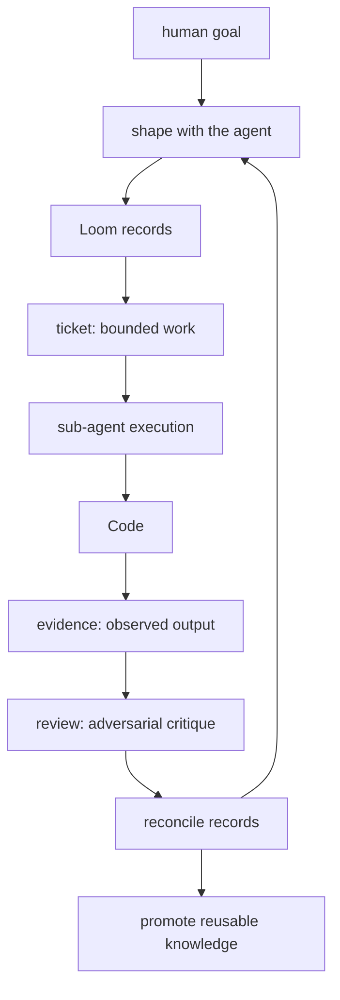
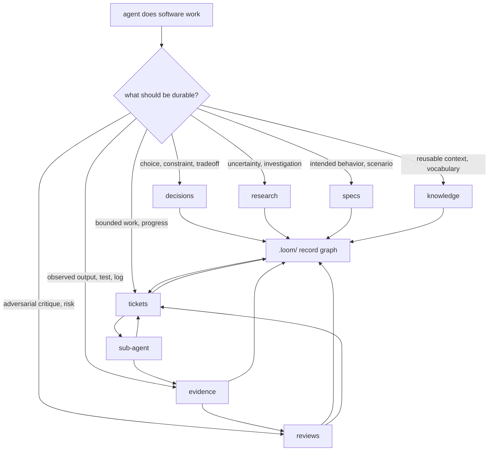

# Agent Loom

The missing middle between prompt and patch.


**Coding agents do better work when the work has a shape.**

AI agents can write patches. The surrounding engineering work often stays in
chat: intent, uncertainty, scope, evidence, review, handoff, and lessons learned.

Agent Loom gives that work a repo-local shape. It turns a coding session into
Markdown records: decisions, research, specs, tickets, evidence, reviews, and
knowledge.

The loop is deliberate: shape vague work with the human before building, decompose
complex work into parent/child tickets, execute through focused sub-agents, and
claim only what evidence and reviews support.

**The session is disposable. The work products compound.**

[Protocol](PROTOCOL.md)

## The Idea

Most agent failures around serious code are process failures. The model jumps
from prompt to patch while the important engineering work stays in chat.

Loom makes the agent externalize that work while it happens:

- what behavior is intended
- what is uncertain
- what is in scope
- what was tried
- what was observed
- what a review challenged
- what future work should reuse

Those records live in `.loom/`. The agent can read them, update them, link them,
hand them to a sub-agent, and continue after context is gone.

The forms are for the model. Humans get the trail.

## The Shape



Read the chart as a recovery path. Tiny work can stay tiny. The graph pays for
itself when work has ambiguity, risk, handoff, review pressure, or future value.

## What Changes

Loom forces useful friction at the exact points where agents usually blur things:

- the outer loop makes shaping the first action, not an afterthought
- specs keep intended behavior out of implementation guesses
- tickets keep scope, acceptance, and progress in one place
- evidence keeps observations separate from model claims
- reviews give important claims an adversarial challenge
- knowledge keeps accepted lessons searchable
- sub-agents stay bounded while tickets carry the durable context

A normal bug fix might leave only a diff and a final answer. Through Loom, the
same work can leave reproduction evidence, root-cause research, a scoped ticket,
green evidence, review findings, and a troubleshooting note that survives before
the diagnosis has to be repeated.

You get the fix and the trace.

## The Record Surfaces

| Surface | Job |
| --- | --- |
| decisions | durable choices, constraints, tradeoffs, ADR format |
| research | investigations, sources, dead ends, conclusions |
| specs | intended behavior, requirements, scenarios, interfaces |
| tickets | bounded work, scope, acceptance, progress, closure |
| evidence | observed facts, outputs, reproductions, screenshots, logs |
| reviews | adversarial critique, findings, verdicts, residual risk |
| knowledge | shared vocabulary, conventions, procedures, troubleshooting |



## When It Helps

Use Loom when the work should be recoverable:

- behavior changes where intent matters
- bugs that need reproduction or root-cause work
- multi-step changes that decompose into parent/child tickets
- tasks that may cross sessions, models, or harnesses
- work that needs tests, screenshots, logs, or other durable evidence
- review findings or residual risk that should survive the current chat
- lessons future agents should reuse

For a one-line obvious edit, use the source tree and Git.

## Loom Mill

Loom Mill is a companion application that provides a visual interface for the
`.loom/` record graph — shaping sessions, ticket visualization, and execution
observation. It reads and writes the same Markdown records the protocol defines.

See [`loom-mill/`](loom-mill/) for details.

## Try It

Copy the contents of [`PROTOCOL.md`](PROTOCOL.md) into your project's `AGENTS.md`,
`CLAUDE.md`, or equivalent harness instructions.

Start working with your coding agent. The protocol changes how it behaves —
shaping before executing, externalizing as it goes, building shared vocabulary.

Records appear in `.loom/` as the agent works.

## Repository Layout

```
.
├── PROTOCOL.md          — the protocol (paste into your harness instructions)
├── AGENTS.md            — contributor guidelines for this repo
├── loom-mill/           — companion visual application
├── loom-core/           — OpenCode plugin skeleton
├── loom-playbooks/      — OpenCode plugin skeleton
└── .loom/               — dogfood records for this repo
```

## The Short Version

Prompt-to-patch is too thin for serious software work.

Loom gives coding agents forms for the parts that usually disappear: intent,
scope, evidence, review, handoff, and reusable knowledge.

The code can change hands. The work can continue.
